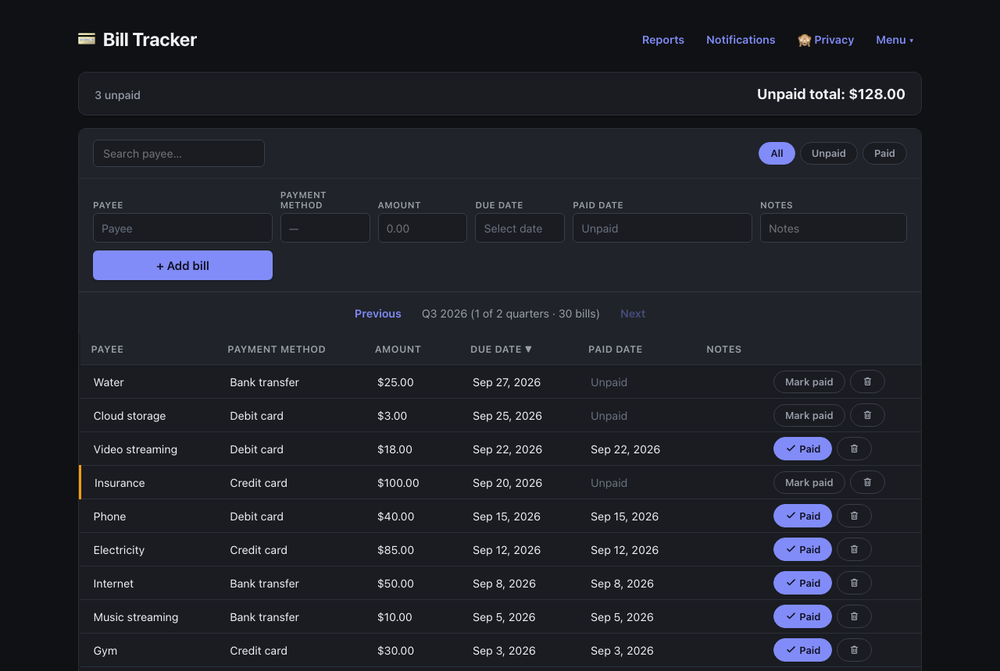

<p align="center">
  
</p>

# Bill Tracker

A bill tracker I built to replace the spreadsheet I was using to keep track of what I owe and when. It has an editable grid that feels like a spreadsheet, CSV import and export, reports, email reminders, and passkey-only accounts, so there are no passwords and no emails to sign up. It runs on Azure and is designed to cost close to nothing.

## Features

- Editable bills grid with inline editing, quarter switcher, and totals
- Payees and payment methods you can rename, and a rename shows up on every bill that uses it
- CSV import with column mapping and a preview that flags bad rows, plus CSV export
- Reports: spending over time, breakdowns by payee and payment method, on-time rate, average days early or late, late payments by payee, spending concentration, month over month change, a watchlist of payees whose bills are creeping up, and your longest current on-time streak
- Email reminders sent once a day at 9am in your timezone, with a digest of bills due soon
- Privacy mode that blurs amounts, and automatic logout after a period of inactivity
- Passkey accounts (WebAuthn). Sign-up is open, and each account's data is isolated from every other account

## Stack

- **Frontend:** React, TypeScript, Vite, TanStack Table and Query
- **API:** Azure Functions v4 (Node and TypeScript), deployed as Azure Static Web Apps managed functions
- **Notifications:** a separate Azure Functions app with a timer trigger, sending mail through Azure Communication Services
- **Database:** Azure SQL Database, serverless free tier
- **Auth:** passkeys through `@simplewebauthn`, with a signed session cookie. No third-party auth service

The notifications worker is its own project because Static Web Apps managed functions only support HTTP triggers, so a timer has to live somewhere else.

## Project layout

```
frontend/              Vite + React SPA
api/                   HTTP API (Static Web Apps managed functions)
notifications-worker/  Timer-triggered function that sends reminder emails
sql/                   Schema, migration script, and local docker-compose
```

`frontend/public/staticwebapp.config.json` is the routing config for Static Web Apps. Vite copies it into `frontend/dist/` on build, which is where Static Web Apps looks for it.

## Running it locally

### What you need

- **Node 20.** Azure Functions Core Tools v4 doesn't work with newer non-LTS Node versions, and you'll get an "incompatible Node.js version" error if you try. There's an `.nvmrc`, so `nvm install && nvm use` picks up the right version.
- **Docker**, for a local SQL Server container. There's no emulator for Azure SQL, so local development runs a real SQL Server in Docker.
- **A passkey authenticator.** Touch ID, Windows Hello, a phone, or a security key all work. A browser with a virtual authenticator also works for testing.

I've run this on Windows and macOS.

### Setup

```bash
npm install --prefix frontend
npm install --prefix api
npm install   # root dev tools: swa-cli, azurite, mssql

cp api/local.settings.json.example api/local.settings.json
```

In `api/local.settings.json`, set `SESSION_SECRET` to anything non-empty. The `SQL_*` values already match the Docker container.

### Start everything

You need three terminals the first time, and two after that.

```bash
# 1. Storage emulator. The Functions host needs it for its own bookkeeping.
npm run dev:azurite

# 2. Local SQL Server (only the first time), then apply the schema
npm run dev:sql
npm run db:migrate   # safe to re-run

# 3. Frontend and API behind one origin
npm run dev
```

Open **http://localhost:4280**, not 5173 or 7071. The WebAuthn origin check is configured for port 4280 and fails on anything else.

`npm run dev:sql:down` stops the SQL container. Your data stays in the Docker volume.

If `npm run db:migrate` fails with "Login failed for user 'sa'" and you also have SQL Server installed natively, that install is probably sitting on port 1433 and answering before the container does. The container is mapped to port 14330 for this reason. If you change the mapping, update `SQL_PORT` to match.

### Running the notifications worker locally

```bash
cp notifications-worker/local.settings.json.example notifications-worker/local.settings.json
```

Fill in `ACS_CONNECTION_STRING` and `NOTIFICATION_SENDER_EMAIL` from an Azure Communication Services resource with an email domain attached, then run `npm start` inside `notifications-worker/` with Azurite running. The timer only fires once a day, so to test it, temporarily change the schedule in `notifications-worker/src/functions/notificationsSend.ts` to run every minute. Change it back before you commit.

### Creating an account

1. Go to `http://localhost:4280/login`
2. Click "New here? Create an account"
3. Give the account an optional name. It only shows up in your passkey picker and the app header.
4. Click "Create account with a passkey" and follow the prompt

You're logged in right away with an empty bill list. Use "Add passkey" in the header to register more devices on the same account.

### Checking a change by hand

There are no automated tests yet, so this is what I click through before calling something done:

1. Create an account and confirm you land on an empty bill list
2. Add a bill and edit every field inline (click a cell, Enter or blur saves, Escape cancels)
3. Mark a bill paid and check that the totals update
4. Delete a bill, reload, and confirm it's gone
5. Log out, confirm `/` redirects to `/login`, then log back in with the passkey
6. Register a second passkey with "Add passkey"
7. Create a second account and confirm it can't see the first account's bills. Recheck this after any change to auth or queries.
8. Import a small CSV with a blank amount, a blank paid date, and a malformed date, and confirm the bad row is flagged
9. Rename a payee that has bills and confirm the grid updates. Try deleting a payee that's in use and confirm it's blocked.

## Deploying to Azure

Nothing in this repo creates Azure resources for you. These are the steps to do it yourself.

You'll need an Azure subscription, the [`az` CLI](https://learn.microsoft.com/cli/azure/install-azure-cli) (logged in), and the code in a GitHub repo.

### 1. Static Web App

In the Portal, create a Static Web App on the Free plan, connect your repo and branch, and set:

- App location: `/frontend`
- Api location: `/api`
- Output location: `dist`

The Portal generates a GitHub Actions workflow and a deployment token secret. Check the generated workflow, because it sometimes defaults the output location to `build`, which is wrong for Vite. It should be `dist`.

CLI version:

```bash
az staticwebapp create \
  --name <your-app-name> \
  --resource-group <your-resource-group> \
  --source https://github.com/<you>/<repo> \
  --branch main \
  --app-location "frontend" \
  --api-location "api" \
  --output-location "dist" \
  --login-with-github
```

### 2. SQL database

```bash
az sql server create \
  --name <globally-unique-server-name> \
  --resource-group <your-resource-group> \
  --location <region> \
  --admin-user <sql-login> \
  --admin-password "<a-strong-password>"

az sql db create \
  --resource-group <your-resource-group> \
  --server <globally-unique-server-name> \
  --name BillTracker \
  --edition GeneralPurpose \
  --family Gen5 \
  --capacity 2 \
  --compute-model Serverless \
  --use-free-limit \
  --free-limit-exhaustion-behavior AutoPause
```

`--use-free-limit` gives you 100,000 vCore-seconds and 32GB of storage per month. With `AutoPause`, the database pauses when you run out instead of charging you. It also pauses after an hour of inactivity, so the first request after a quiet period can take a while while it wakes up.

Anything that keeps a connection open stops the database from pausing, and that's what uses up the free budget. If you add a background job, close its connection when it finishes. This project's worker does, and it only runs once a day for the same reason.

Azure SQL blocks everything by default, including Azure's own services, so add this firewall rule:

```bash
az sql server firewall-rule create --resource-group <your-resource-group> --server <globally-unique-server-name> \
  --name AllowAzureServices --start-ip-address 0.0.0.0 --end-ip-address 0.0.0.0
```

`0.0.0.0` to `0.0.0.0` is Azure's special value for "allow Azure services". It doesn't open the server to the internet. If you skip it, the app fails with a generic connection timeout that doesn't mention the firewall. To run the migration from your own machine, also add a rule for your IP.

Apply the schema:

```bash
SQL_SERVER=<globally-unique-server-name>.database.windows.net SQL_DATABASE=BillTracker \
SQL_USER=<sql-login> SQL_PASSWORD="<a-strong-password>" npm run db:migrate
```

### 3. App settings for the API

```bash
az staticwebapp appsettings set --name <your-app-name> \
  --setting-names \
    SQL_SERVER="<globally-unique-server-name>.database.windows.net" \
    SQL_DATABASE="BillTracker" \
    SQL_USER="<sql-login>" \
    SQL_PASSWORD="<a-strong-password>" \
    SESSION_SECRET="$(openssl rand -base64 32)" \
    RP_ID="<your-app-name>.azurestaticapps.net" \
    ORIGIN="https://<your-app-name>.azurestaticapps.net"
```

Don't set `SQL_TRUST_SERVER_CERT` in production. It's only for the self-signed cert in local Docker. `ORIGIN` must match the site's URL exactly, with no trailing slash, or passkey registration fails with a vague `internal_error`.

If you add a custom domain later, update `RP_ID` and `ORIGIN`. Passkeys are tied to the RP ID they were created under, so changing it invalidates every existing passkey. Pick your final domain before you register anything.

### 4. Notifications worker

This is a standalone Function App, separate from the Static Web App.

1. Create an **Azure Communication Services** resource and an **Email Communication Service** with a domain attached (the free Azure-managed domain works), then connect the domain to the ACS resource.
2. Create a **Function App** (Node 20). Link Application Insights or you won't be able to see any logs.
3. Under Configuration, turn on **SCM Basic Auth Publishing Credentials**, or the GitHub Action can't deploy.
4. Add these app settings:

   ```
   SQL_SERVER, SQL_DATABASE, SQL_USER, SQL_PASSWORD   same values as the API
   ORIGIN                                             the site URL, no trailing slash
   ACS_CONNECTION_STRING                              from the ACS resource's Keys page
   NOTIFICATION_SENDER_EMAIL                          DoNotReply@<your-domain>.azurecomm.net
   WEBSITE_RUN_FROM_PACKAGE                           1
   ```

   `WEBSITE_RUN_FROM_PACKAGE=1` matters. Without it the deploy copies thousands of `node_modules` files one by one and times out with a 500.

5. Download the Function App's publish profile and save it as a GitHub secret. The workflows in `.github/workflows/` expect `AZURE_FUNCTIONAPP_PUBLISH_PROFILE_NOTIFICATIONS_STAGING` and `AZURE_FUNCTIONAPP_PUBLISH_PROFILE_NOTIFICATIONS_PROD`. Download a fresh profile after enabling SCM basic auth, since an older one won't work. Also update `app-name` in each workflow to your Function App's name.

The timer runs once a day at 13:00 UTC. That's 9am Atlantic Standard Time, and it's deliberately set to the winter offset so it never fires before 9am local. Each user's local time is checked on every run, so it still works for other timezones, just a few hours off. See the comments in `notificationsSend.ts` for the reasoning.

### 5. Deploy and sign up

Push to the connected branch and GitHub Actions builds and deploys. Then open `https://<your-app-name>.azurestaticapps.net/login` and create an account. Anyone who finds the URL can do the same.

### Rotating the session secret

Rotating `SESSION_SECRET` logs everyone out but doesn't affect passkeys:

```bash
az staticwebapp appsettings set --name <your-app-name> --setting-names SESSION_SECRET="$(openssl rand -base64 32)"
```

### Cost

The Static Web Apps free tier is $0. The SQL free tier is $0 as long as you stay under the monthly allowance, and if you go over it pauses until next month, so you won't get a bill. Azure Communication Services is pay per email, and at the volume of a personal app it rounds to almost nothing. Check the Cost Analysis page in the Portal after the first week to be sure.

## Staging

I run staging as a completely separate Static Web App tied to a `staging` branch, with its own database, its own notifications Function App, and its own secrets. I don't use Static Web Apps' built-in preview environments, because those share app settings with production.

To set it up, repeat the deploy steps above with a second Static Web App on the `staging` branch and a second database (`BillTrackerStaging`), with a fresh `SESSION_SECRET`. Keep `main` and `staging` as separate branches. Test on `staging` first, then bring changes over to `main`.

Passkeys don't carry over between environments, since each one has its own RP ID. You'll make separate test accounts on staging, which is usually what you want anyway.

## Security notes

- **Sign-up is open.** There's no email verification and no invite. Each account's data is isolated, so the realistic downside is junk accounts using up your free database budget, not one account reading another's.
- **Isolation is enforced in the queries.** Every query filters on `user_id`, taken from the signed session and never from the request. Asking for another account's bill just returns nothing. This is a convention in the code, not something the database enforces, so keep it up when you add new queries.
- **There is no rate limiting** on sign-up or anything else. Each sign-up needs a real WebAuthn ceremony, which slows down scripts, but it isn't a real defense. If you make a deployment public, add rate limiting first.
- **There's no account recovery.** With no email on the account, losing every registered passkey means losing the account. Add a second device with "Add passkey" as a backup.
- **The database auto-pauses**, so the first request after a while is slow. I don't use a keep-alive ping, because that would burn through the free allowance for no benefit.

## Moving over from a spreadsheet

Export your spreadsheet to CSV and use "Import CSV" in the app. It looks for Payee, Amount, Due Date, Paid Date, Payment Method, and Notes columns and guesses the mapping, which you can change if your headers are different. Rows with dates or amounts it can't parse are flagged in the preview and skipped, and they don't block the rest of the import.
